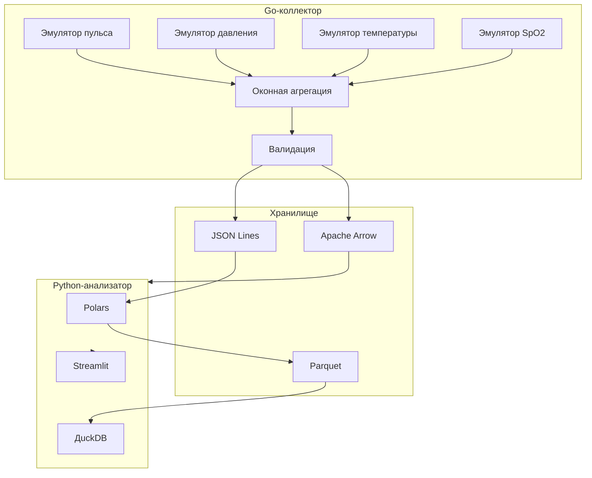

# Lab 14 - Medical Data ETL Pipeline

Автор: Гармашов Виталий Валерьевич
Группа: 221331
Вариант: 22
Предметная область: Мониторинг медицинских данных (эмуляция датчиков здоровья)
Уровень: задания повышенной сложности

## Цель

Разработать ETL-конвейер для мониторинга медицинских данных с использованием Go для сбора и предобработки, Python для анализа и визуализации, Rust для валидации.

## Реализованная система

Проект представляет собой конвейер обработки медицинских данных. Go-коллектор собирает данные с эмулированных датчиков здоровья, выполняет оконную агрегацию и валидацию. Python-анализатор обрабатывает данные через Polars/DuckDB, визуализация — Streamlit.

| Компонент | Язык | Назначение |
|---|---|---|
| `go/collector` | Go | Сбор данных, оконная агрегация, валидация |
| `rust/validator` | Rust | Валидация медицинских показателей |
| `python/analyzer.py` | Python | Polars/DuckDB анализ |
| `python/dashboard` | Python/Streamlit | Веб-дашборд реального времени |
| NATS | broker | Потоковая передача данных |
| etcd | coordinator | Распределённая координация |

## Выполненные задания повышенной сложности

### 1. Распределённый сборщик на Go (etcd)

Реализован `distributed.go` с:
- Регистрацией инстансов в etcd
- Распределением шардов между экземплярами
- Health check и leader election
- Goroutine-based параллельным сбором

### 2. Оконная агрегация в Go

Реализована в `aggregator.go`:
- Tumbling windows (5 секунд)
- Sliding windows (30 секунд)
- Метрики: AVG, MIN, MAX, COUNT
- Агрегация по пациентам и типам датчиков

### 3. Передача данных через Apache Arrow

Реализована в `arrow_writer.go` и `python/arrow_client.py`:
- Сериализация в бинарный формат Arrow
- Flight RPC сервер/клиент
- Сравнение объёма данных Arrow vs JSON

### 4. Rust-библиотека для валидации

Реализована в `rust/validator/`:
- Валидация пульса (30-220 bpm)
- Валидация давления (систолическое 60-250, диастолическое 40-150)
- Валидация температуры (35-42°C)
- Валидация SpO2 (70-100%)
- Интеграция через cgo

### 5. Сравнение производительности Go vs Python + NATS

Реализовано в `collector_async.py` и `nats_publisher.go`:
- Python async collector (asyncio/aiohttp)
- NATS JetStream publisher
- Замеры производительности: throughput, memory, CPU
- Сравнительный отчёт

### 6. Веб-дашборд Streamlit

Реализован в `python/dashboard/app.py`:
- Временные ряды для всех датчиков
- Распределения значений
- Alerts при выходе за пределы нормы
- Статистика по пациентам

## Архитектура



## Структура проекта

```text
lab 14/
├── go/collector/              # Go-коллектор
│   ├── main.go                # Главный модуль
│   ├── sensors.go             # Эмулятор датчиков
│   ├── aggregator.go          # Оконная агрегация
│   ├── distributed.go         # etcd координация
│   ├── nats_publisher.go      # NATS JetStream
│   ├── rust_validator.go      # Rust валидация (cgo)
│   ├── validator_go.go         # Fallback валидация
│   └── arrow_writer.go        # Arrow сериализация
├── rust/validator/             # Rust-библиотека
│   ├── Cargo.toml
│   └── src/lib.rs            # Валидация показателей
├── python/                    # Python-анализ
│   ├── analyzer.py           # Polars/DuckDB
│   ├── collector_async.py    # Async коллектор
│   ├── arrow_client.py       # Arrow/NATS клиент
│   ├── performance_test.py    # Сравнение Go vs Python
│   ├── requirements.txt
│   ├── Dockerfile
│   └── dashboard/app.py      # Streamlit UI
├── data/                      # Генерируемые данные
├── docker-compose.yml
├── pytest.ini
├── PROMPT_LOG.md
└── README.md
```

## Быстрый старт

### Go коллектор

```powershell
cd go/collector
go run -tags nogorust .
```

### Python анализ

```powershell
cd python
pip install -r requirements.txt
python analyzer.py
```

### Streamlit дашборд

```powershell
cd python
streamlit run dashboard/app.py
```

### Docker Compose

```powershell
docker compose up -d
```

## Тестирование

Go-тесты:

```powershell
cd go/collector
go test ./...
```

Python-тесты:

```powershell
cd python
pip install -r requirements.txt
python -m pytest
```

## Диапазоны валидации

| Показатель | Допустимый диапазон | Норма |
|---|---|---|
| Пульс | 30-220 bpm | 60-100 bpm |
| Систолическое давление | 60-250 mmHg | 90-140 mmHg |
| Диастолическое давление | 40-150 mmHg | 60-90 mmHg |
| Температура | 35-42°C | 36.1-37.2°C |
| SpO2 | 70-100% | 95-100% |

## Основные файлы

| Файл | Назначение |
|---|---|
| `PROMPT_LOG.md` | Журнал промптов и этапов выполнения |
| `go/collector/main.go` | Главный модуль коллектора |
| `go/collector/aggregator.go` | Оконная агрегация |
| `rust/validator/src/lib.rs` | Rust валидация |
| `python/analyzer.py` | Polars/DuckDB анализ |
| `python/dashboard/app.py` | Streamlit дашборд |
| `docker-compose.yml` | NATS, etcd, сервисы |

## Технологии

- Go 1.21+ (goroutines, channels, cgo)
- Rust (cgo integration)
- Python 3.10+ (Polars, DuckDB, Streamlit)
- Apache Arrow
- NATS JetStream
- etcd
- Docker Compose
